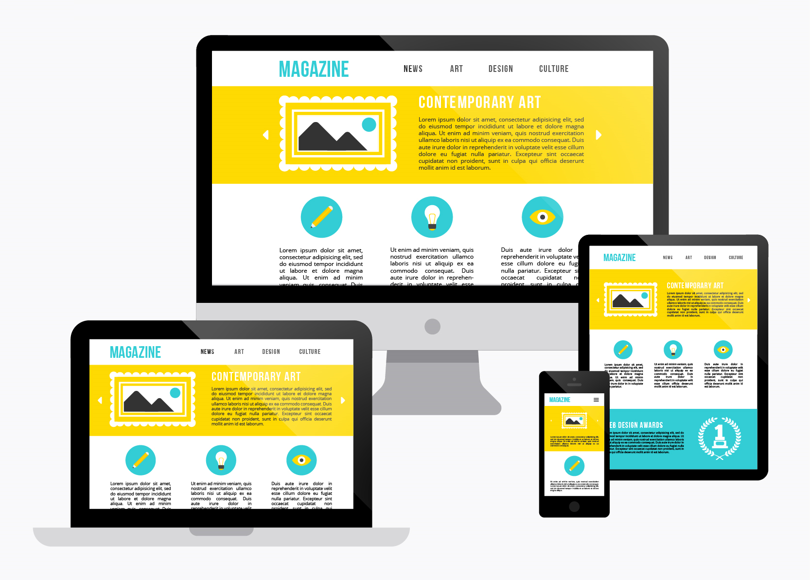
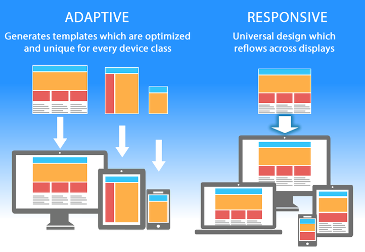
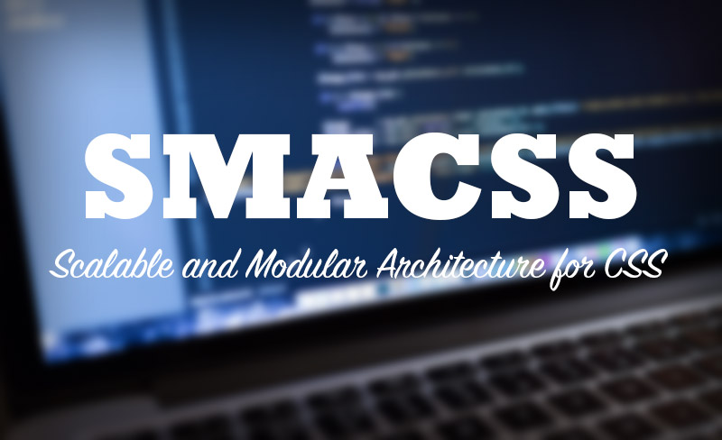

# Read: 01 - SMACSS and Responsive Web Design

*Today Topic will be a about*
- RESPONSIVE WEB DESIGN
- SMACSS 

## RESPONSIVE WEB DESIGN


> What is Responsive Web Design?



*It's about designing The websites that act with multiple screen sizes/resolutions.*
*where Sites* `should work` *under any platform, any browser size, any orientation.* `The user should have the power.`

*A small screen should NOT mean less content and People are doing more on their phones than ever before and* `Never` *assume the user won’t need access to a functionality*

*There is  a Online Tools to check if the site is responsive or Not* [responsivedesign](http://ami.responsivedesign.is/)


> Responsive vs. Adaptive vs. Mobile



* Responsive Web Design (RWD) – `fluid measurements` , `flexible grids` , `and varying CSS rules`

*where the server is sending back the same code regardless of the device This can be detected automatically, by looking for meta name* `viewport`

* Adaptive Design (dynamic serving) – returns one of multiple versions of a page `based` on the type of device .

*where Server returns different code (HTML and CSS) depending on the device requesting the page. and the same* `URL` *is used and May get messed up if the wrong device type is detected.*

* Separate Mobile Site (.m)-  `separate` page URL for the mobile site .

*Separate URLs serve different code to desktop and mobile devices (and perhaps even tablets), and on different URLs.*

> Why RWD?

- Easier to share your data with a single URL
- Easier for search engines (Google) to index the page
- Fewer files = less maintenance
- Less redirection = lower load time

>Fluid Measurements

*The* `viewport` *is the user's visible area of a web page.*
*The* `viewport` *varies with the device, and will be smaller on a mobile phone than on a computer screen.*

* Absolute measurements

*Like* `px` `pt` `pc`  `mm` `cm` `in`

* Relative measurements

*Like* `% ` `em` `rem`  `vw` `vh` 

> Media Queries


*Media queries allow the style to depend upon the media properties*

*CSS3 increased the capabilities. Style can depend on many features*  `width`  `height`  `orientation`  `resolution`

**The Two Query Components** 

- A media type `screen` `print` `all`

- The actual query of a media feature and trigger size `width` `height` `orientation ` `resolution`

**How to implement media queries**

- Use the @import rule
```
@import url(smallstyle.css) screen and (min-width:600px)
```

- Put media query directly in the style sheet
```
@media screen and (min-width:500px){..}
```
- Include query in the link
```
<link rel = “stylesheet” media = “screen and (min-width:
400px)”> and (orientation: portrait)>
```

**For Example**

```
@media screen and (min-width:500px){
 p.desc {
 display: block;
 font-size: 150%; }
}
@media screen and (min-width:900px){
 p.desc {
 display: inline-block;
 width: 35%;
 font-size:125%; }
}

```

> Breakpoints

**What are Breakpoints**
*Breakpoints are sizes or positions that define a change in your site layout or content.*
*Used to provide best possible experience for users based on device information.*

**Determining the Breakpoints**
*Breakpoints should correspond to:*
- devices 
- content 

**Mobile first**


*The mobile first approach includes using styles targeted at smaller viewports as the default styles for a website, then use media queries to add styles as the viewport grows.*

*A breakout of mobile first media queries might look at bit like the following.*

```
/* Default styles first then media queries */
@media screen and (min-width: 400px)  {...}
@media screen and (min-width: 600px)  {...}
@media screen and (min-width: 1000px) {...}
@media screen and (min-width: 1400px) {...}

```

> SMACSS


*SMACSS is becoming one of the most useful contributions to front-end discussions in years*

*Smacss (Scalable and Modular Architecture for CSS) is a style guide that follows five simple categories. SMACSS is a way to examine design process and to fit those rigid frameworks into a flexible thought process. It is an attempt to document a consistent approach to site development when using CSS.*


## Contact Info : 
**Please Feel Free To Contact Me When You Need help ^_^**
* [www.facebook.com/aghyadalbalkhi](www.facebook.com/aghyadalbalkhi)
* Email : aghyadalbalkhi@gmail.com