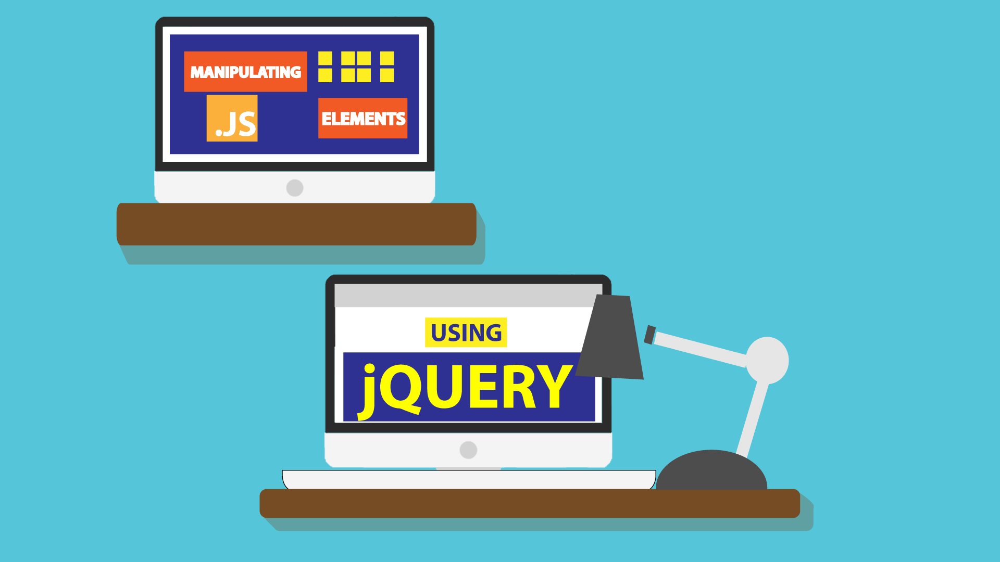
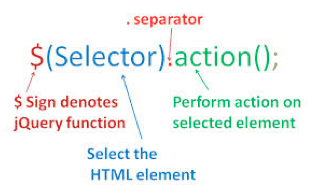
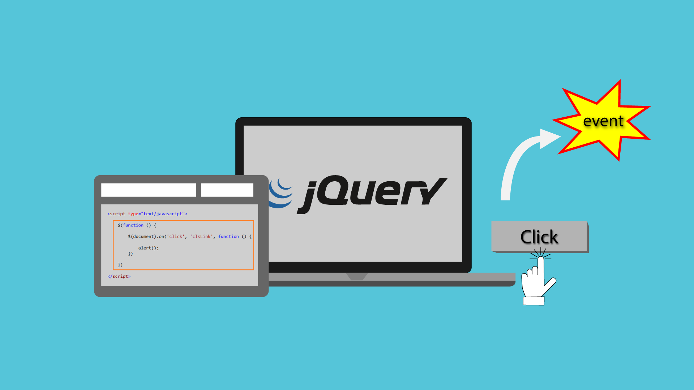
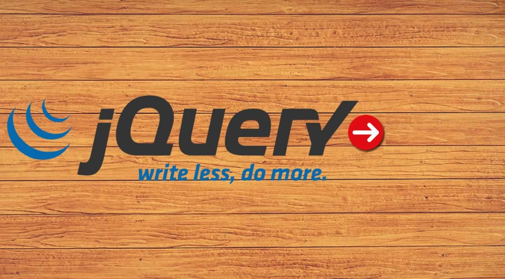
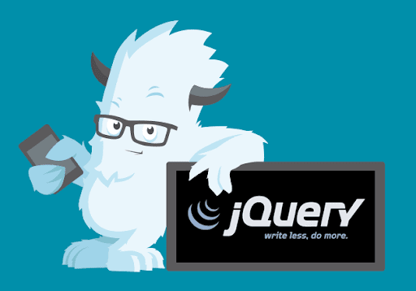
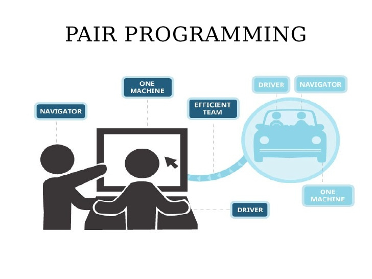

# Read: 02 - jQuery, Events, and The DOM

*Today Topic will be a about*
- JavaScript and jQuery
- 6 Reasons for Pair Programming

## JavaScript and jQuery

> What is jQuery?



*jQuery is not a language, but it is a well written JavaScript code. As quoted on official jQuery website, "it is a* `fast` and `concise` `JavaScript Library` *that simplifies HTML document traversing, event handling, animating, and Ajax interactions for rapid web development."*

> jQuery Selectors



* Element Selector

*The jQuery element selector selects elements based on the element name*

```
$("p")
```

**For Example**

```
$(document).ready(function(){
  $("button").click(function(){
    $("p").hide();
  });
});

```

*The Code Resource* [W3School](https://www.w3schools.com/jquery/tryit.asp?filename=tryjquery_hide_p)

* The Id Selector 

*The jQuery* `#id` *selector uses the id attribute of an HTML tag to find the specific element.*


```
$("#test")

```

**For Example**

```
$(document).ready(function(){
  $("button").click(function(){
    $("#test").hide();
  });
});

```

**Finally We Have Many Way to Select an Element in jQuery** [W3School](https://www.w3schools.com/jquery/jquery_selectors.asp)


> jQuery Event



*All the different visitors' actions that a web page can respond to are called* `events`

**Example of Events**
- Moving a mouse over an element
- Selecting a radio button
- Clicking on an element

**CLICK() Event**
`SYNTAX`
```
$(“selectElement”).click(function(){
//Lines of code
});

```

**Example**

HTML Code 
```

<!DOCTYPE html>
<html>
    <head>
        <title>jQuery Events</title>
        <script type="text/javascript" src="https://code.jquery.com/jquery-3.3.1.min.js"></script>
    </head>
    <body>
        <h1>jQuery Events</h1>
        <p>This is jQuery evenets tutorials</p>
        <button>Don't Click me</button>
    </body>
</html>


});  

```
jQuery Code 

```
$("button").click(function(){

alert("Eh! why you clicked this button!");
```


> Why is jQuery ? 



- jQuery is widely used
- Promotes simplicity
- Cross-browser compatibility
- Clean and beautiful syntax
- Lightweight and lean
- Open source library
- Animations and cool effects
- Highly extensible
- Pages load faster
- SEO-friendly
- Utility features


**Resource** [W3School](https://tekslate.com/11-benefits-jquery-every-web-designers-know)


> jQuery Method `Set` `Get` Data

*Three simple, but useful, jQuery methods for DOM manipulation are:*

* `text()` - Sets or returns the text content of selected elements
* `html()` - Sets or returns the content of selected elements (including HTML markup)
* `val()` - Sets or returns the value of form fields

**For Example**
```
$("#btn1").click(function(){
  alert("Text: " + $("#test").text());
});
$("#btn2").click(function(){
  alert("HTML: " + $("#test").html());
});

```
Live URL Example = > [W3School](https://www.w3schools.com/jquery/tryit.asp?filename=tryjquery_dom_html_get)

**Ready Method**
*The* `ready  Method` *run when the DOM (document object model) has been loaded.*

*The ready() method specifies what happens when a ready event occurs.*

**Syntax**
```
$(document).ready(function)
```

> Adding jQuery to  Web Pages



*There are several ways*
* Download the jQuery library locally
* using CDN Service

**Downloading jQuery**

Download it from here = > [jquery](http://jquery.com/download/) and put it inside `<head>`

```
<head>
<script src="jquery-3.5.1.min.js"></script>
</head>
```

**using CDN Service**

*include it from a CDN (Content Delivery Network).*

```
<head>
<script src="https://ajax.googleapis.com/ajax/libs/jquery/3.5.1/jquery.min.js"></script>
</head>

```
 
## 6 Reasons for Pair Programming



> How does pair programming work?
*Pair programming is  software development technique in which two developers work on the same block of code. the* `Driver` *and the* `navigator`

> Why pair program?
*Two heads are better than one*

> Benefits of pair program?

- Knowledge Share and Bus-Factor mitigation
- Discussions and bring better solutions
- Two heads are better than one
- Much faster onboarding of new developers


## Contact Info : 
**Please Feel Free To Contact Me When You Need help ^_^**
* [www.facebook.com/aghyadalbalkhi](www.facebook.com/aghyadalbalkhi)
* Email : aghyadalbalkhi@gmail.com

