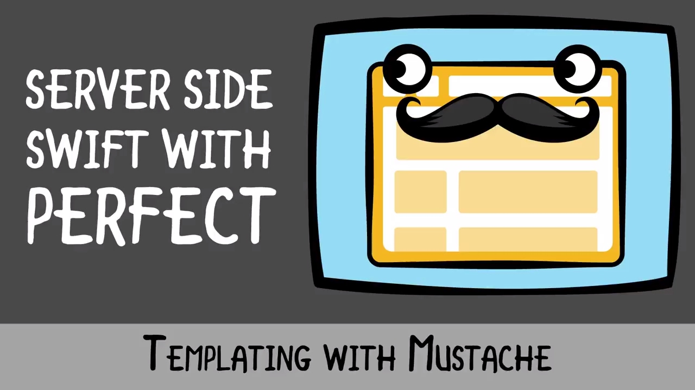

# Read: 03 - Flexbox and Templating

*Today Topic will be a about*
- Templating 
- Flexbox

## Templating

> JavaScript Templating

*JavaScript templating is the use of JSON data sources to quickly and efficiently render client-side view templates. The template is HTML markup, with added templating tags that will either insert variables or run programming logic; the engine replaces variables and instances with actual values at runtime.*

> What is Mustache?

*Javascript templating is a fast and efficient technique to* `render` *client-side view templates with Javascript by using a JSON data source. The template is HTML markup, with added templating tags that will either insert variables or run programming logic.*

*The template engine replaces variables and instances declared in a template file with actual values at runtime, and convert the template into an HTML file sent to the client.*

`Mustache is a logic-less template syntax. This syntax works by expanding tags in a template using values provided in a hash or object. It doesn't deal with logic statements, clauses or loops, it only deals with tags.Its is important to note that mustache is not a templating engine, it is a specification for a templating language.`

> What is Flexbox

The `flexbox` layout is used to efficiently lay out, align and distribute space among items in a container (even when the container's dynamics are unknown). The main idea behind the flex layout is to give the container the ability to alter its items’ width/height to best fill the available space, it has proven to be especially beneficial in accommodating to different devices and screen sizes. The parent element (the flex container) and the child elements (the flex items) have different properties that will be mentioned in the section below. Most importantly, flex layout is based on flex-flow directions:

* `main axis` – The main axis of a flex container is the primary axis along which flex items are laid out.

* `main-start | main-end` – The flex items are placed within the container starting from main-start and going to main-end.

* `main size` – A flex item’s width or height, whichever is in the main dimension, is the item’s main size.

* `cross axis` – The axis perpendicular to the main axis is called the cross axis. Its direction depends on the main axis direction.

* `cross-start | cross-end` – Flex lines are filled with items and placed into the container starting on the cross-start side of the flex container and going toward the cross-end side.

* `cross size` – The width or height of a flex item, whichever is in the cross dimension, is the item’s cross size.

**Flex Container**

| Property       | Usage  |
|-------------------------|----------------------------------------------------------------------------------------------------|
| display       | enables a flex context for all its direct children  |
| flex-direction  | establishes the main-axis  |
| flex-wrap	       | allow the items to wrap as needed  |
| flex-flow	       | shorthand for the flex-direction and flex-wrap properties |
| justify-content  | defines the alignment along the main axis |
| align-items	       | defines the alignment along the cross axis |
| align-content	 | aligns where there is extra space in the cross-axis |

**Flex Items**

| Property       | Usage  |
|-------------------------|----------------------------------------------------------------------------------------------------|
| order	  | controls the order in which items appear in container |
| flex-grow	  | dictates what amount of the available space the item should take up  |
| flex-shrink	  | defines the ability to shrink if necessary  |
| flex-basis | defines the default size of an element before the remaining space is distributed |
| flex  | shorthand for flex-grow, flex-shrink and flex-basis combined |
| align-self	 | allows the default alignment to be overridden for an individual items |

## Contact Info : 
**Please Feel Free To Contact Me When You Need help ^_^**
* [www.facebook.com/aghyadalbalkhi](www.facebook.com/aghyadalbalkhi)
* Email : aghyadalbalkhi@gmail.com

