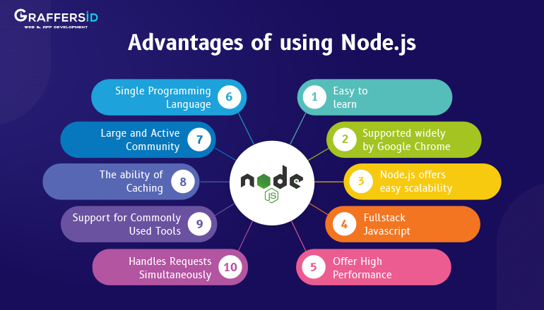
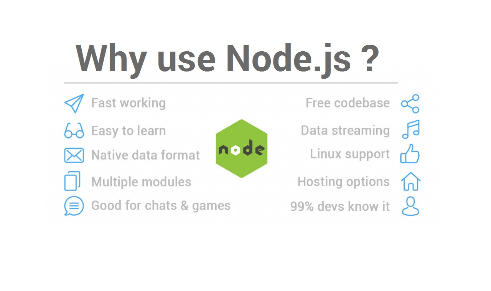

# Readings: NODE.JS

*Today Topic will be a about*
- NODE.JS

## NODE.JS

> What is NODE.JS ? 

*Node.js is a free of charge open-source server environment that runs on various platforms using modern JavaScript on the server. It is built on `Chrome’s V8` JavaScript engine. Node JS was designed to easily create fast and scalable web applications. It is well-scalable, because it relies on the non-blocking I/O model.*

*Node.js is an open source, cross-platform runtime environment for developing server-side and networking applications. Node.js applications are written in JavaScript, and can be run within the Node.js runtime on OS X, Microsoft Windows, and Linux.* 

*ou can check that Node is installed on your system by opening a terminal and typing `node --v.` If all has gone well, you should see something like `v12.14.1`*

> Node.js advantages:

* Speed and scalability.
* You can do everything in the same language.
* It speaks JSON. JSON is probably the most important data exchange format on the Web.
* JavaScript is ubiquitous.

> Why Node.js is so popular?

*One of the biggest reasons why Node.js benefits from increasing popularity is because it uses JavaScript programming language for app development. Since JavaScript is a language that most developers know, switching from any technology to Node.js is an easy task.*

> WHERE NODE.JS CAN BE USED

**SERVER-SIDE WEB APPLICATIONS**

*Node.js with Express.js can also be used to create classic web applications on the server-side. However, while possible, this request-response paradigm in which Node.js would be given around rendered HTML is not the most typical use-case. There is brawl to be made for and against this approach. Here are some facts to consider:*

**Pros:**

- If your application doesn’t have any CPU intensive computation, you can build it in Javascript top-to-bottom, even down to the database level if you use JSON storage Object DB like MongoDB. This eases development (including hiring) significantly.

- Crawlers receive a fully-rendered HTML response, which is far more SEO-friendly than, say, a Single Page function or a web sockets app run on top of Node.js.

**Cons:**

- Any CPU intensive computation will block Node.js responsiveness, so a threaded platform is a better approach. Alternatively, you could try scaling out the computation [*].

- Using Node.js with a relational database is still quite a pain (see below for more detail). Do yourself a favor and pick up any other environment like Rails, Django, or ASP.Net MVC if you’re trying to perform relational operations. [*] An alternative to this CPU intensive estimation is to create a highly scalable MQ-backed environment with back-end processing to keep Node as a front-facing ‘clerk’ to handle client requests asynchronously.

**Note**
*Node.js was never created to solve the compute scaling problem. It was initiated to solve the I/O scaling problem, which it does really well.*