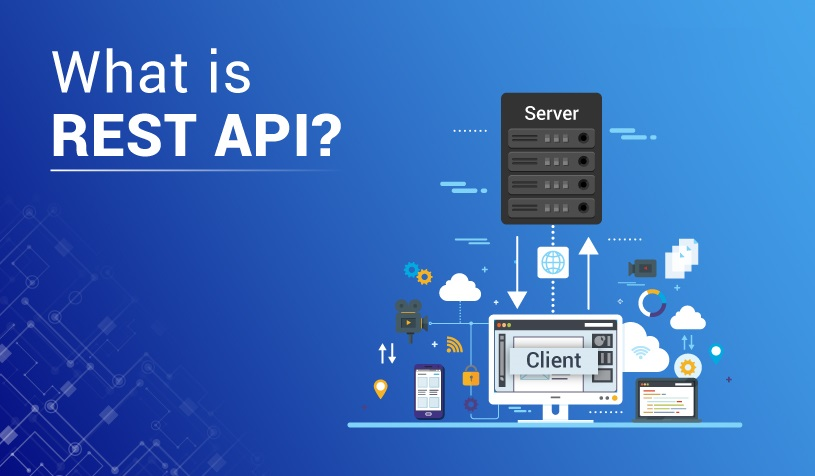
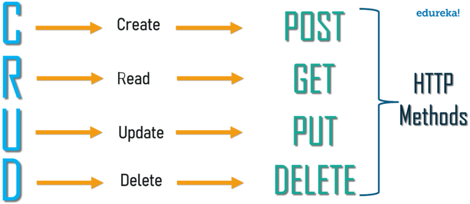

# Read: 07 - APIs continued

*Today Topic will be a about*
- REST API

## REST

> What is REST API? 

*The term REST stands for REpresentational State Transfer. It is an architectural style that defines a set of rules in order to create Web Services. For example, if the user is requesting for a movie in Bangalore at a certain place and time, then you can create an object on the server-side..*

*So, over here, you have an object and you are sending the state of an object. This is why REST is known as* `Representational State Transfer.`

> Why use REST API?

*REST demands the use of hypertext, which scales very well since the client and server are very loosely coupled. With REST, the server is free to change the exposed resources at will. There is no fixed API above and beyond what REST itself defines. The client needs only know the initial URI, and subsequently chooses from server-supplied choices to navigate or perform actions. A server may download code to the client which aids in navigation and state representation.*

> Principles of REST API

- Stateless
- Client-Server
- Uniform Interface
- Cacheable
- Layered system
- Code on demand

> Methods of REST API

*it use the HTTP methods in REST for performing the basic CRUD operations.*

*Let suppose you wish to GET or DELETE any data from the student having student ID as 10. The resource URI of such operation will be http://localhost/appName/student/10. Now the catch is how a server can identify which request is associated with GET operation and which one is associated with DELETE for the same URI. It is by checking the HTTP method parameter that will be 'GET', and for the second case, it should be 'DELETE'.*

### The standard HTTP methods are:
* GET
* PUT
* POST
* DELETE

> How to create a REST API?

*we will need to install the following:*

- Node.js

- Express.js

- Joi

- nodemon (Node Monitor)

> SuperAgent

*SuperAgent is light-weight progressive ajax API crafted for flexibility, readability, and a low learning curve after being frustrated with many of the existing request APIs.*

## Contact Info : 
**Please Feel Free To Contact Me When You Need help ^_^**
* [www.facebook.com/aghyadalbalkhi](www.facebook.com/aghyadalbalkhi)
* Email : aghyadalbalkhi@gmail.com

