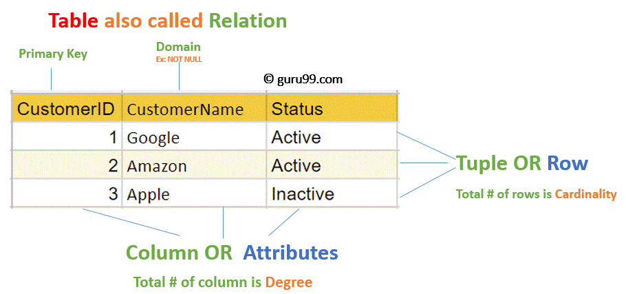

# Read: 08 - SQL

*Today Topic will be a about*
- SQL

## SQL

> What is SQL ? 


*SQL, or `Structured Query Language` is a language designed to allow both technical and non-technical users `query`  `manipulate ` and `transform` data from a relational database. And due to its simplicity, SQL databases provide safe and scalable storage for millions of websites and mobile applications.*


> What Can SQL do?

* SQL can `execute queries` against a database
* SQL can `retrieve` data from a database
* SQL can `insert` records in a database
* SQL can `update` records in a database
* SQL can `delete` records from a database
* SQL can `create` new databases
* SQL can `create` new tables in a database
* SQL can `create` stored procedures in a database
* SQL can `create` views in a database
* SQL can `set` permissions on tables, procedures, and views


> How To Use SQL In Website ? 

*To Deal with SQL in Our Website we need to :*

- An RDBMS database program
- Server-side scripting language

**RDBMS** `RDBMS stands for Relational Database Management System.`

*The data in `RDBMS` is stored in database objects called `tables` A table is a collection of related data entries and it consists of `columns` and `rows`.*

**Table**


Every table include :

- fields / column 
- record / Row

**Database**
*A database most often contains one or more tables. Each table is identified by a name (e.g. "Customers" or "Orders"). Tables contain records (rows) with data.*

**For Example**

| CustomerID       | CustomerName  | ContactName |Address | City
|-------------------|---------------|-------------|---------------------|------------------------|
| 1       | aghyad  |fahed 	|Obere Str. 57	|Berlin	
| 2       | Sezar   |khalil	|Obere Str. 57	|London	
| 3       | ayat    |osemah	|Obere Str. 57	|UK	

```
The table above contains three records (one for each customer) and five columns (CustomerID, CustomerName, ContactName, Address, City).

```


> SQL Statements

* SQL SELECT Statement

*The SELECT statement is used to select data from a database.*

`Select The column1 , column2 From Table`
```
SELECT column1, column2, ...
FROM table_name;
```

*If you want to select all the fields available in the table, we use the syntx:*

```
SELECT * FROM table_name;

```

 >  SQL WHERE Statement

 *The WHERE clause is used to filter records.* 

 `selects all the customers from the country "Mexico", in the "Customers" table`

 ```
SELECT * FROM Customers
WHERE Country='Mexico';
```
> SQL AND, OR and NOT Operators

*The AND and OR operators are used to filter records based on more than one condition*

**AND Syntax**
```
SELECT * FROM Customers
WHERE Country='Germany' AND City='Berlin';
```


**OR Example**
```
SELECT * FROM Customers
WHERE Country='Germany' OR Country='Spain';
```

**NOT Example**
```
SELECT * FROM Customers
WHERE NOT Country='Germany';
```

**There are alot of Query Stetment That u can used in database**
[W3School](https://www.w3schools.com/sql/default.asp)

## Contact Info : 
**Please Feel Free To Contact Me When You Need help ^_^**
* [www.facebook.com/aghyadalbalkhi](www.facebook.com/aghyadalbalkhi)
* Email : aghyadalbalkhi@gmail.com
