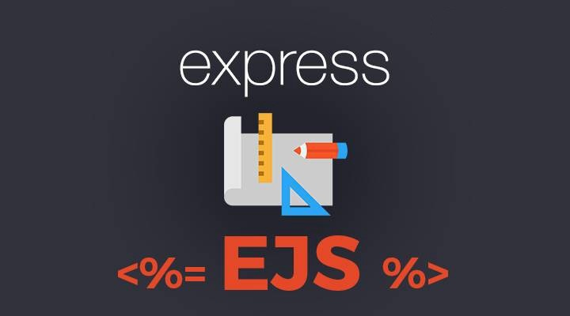

# Read: 11 - EJS

*Today Topic will be a about*
- EJS

> What is EJS ? 




- *What is the "E" for? "Embedded?" Could be. How about "Effective," "Elegant," or just "Easy"? EJS is a simple templating language that lets you generate HTML markup with plain JavaScript. No religiousness about how to organize things. No reinvention of iteration and control-flow. It's just plain JavaScript.*

- *Where is EJS used? EJS is used in node.js when working with the Express framework as a templating engine to help render JavaScript code on the client-side.*

**Features** 

* Simple syntax
* Fast development time
* Use plain JavaScript
* Speedy execution
* Easy debugging
* Active development

**Tags**
- `<% `'Scriptlet' tag, for control-flow, no output
- `<%_` ‘Whitespace Slurping’ Scriptlet tag, strips all whitespace before it
- `<%=` Outputs the value into the template (HTML escaped)
- `<%-` Outputs the unescaped value into the template
- `<%#` Comment tag, no execution, no output
- `<%%` Outputs a literal '<%'
- `%> `Plain ending tag
- `-%>` Trim-mode ('newline slurp') tag, trims following newline
- `_%>` ‘Whitespace Slurping’ ending tag, removes all whitespace after it

**Includes**

*Includes are relative to the template with the `include` call. (This requires the 'filename' option.) For example if you have "./views/users.ejs" and "./views/user/show.ejs" you would use `<%- include('user/show'); %>.`*

*You'll likely want to use the raw output tag `(<%-)` with your include to avoid double-escaping the HTML output.*

```
<ul>
  <% users.forEach(function(user){ %>
    <%- include('user/show', {user: user}); %>
  <% }); %>
</ul>

```


**Example**

```
<% if (user) { %>
  <h2><%= user.name %></h2>
<% } %>
```

```
let template = ejs.compile(str, options);
template(data);
// => Rendered HTML string

ejs.render(str, data, options);
// => Rendered HTML string

ejs.renderFile(filename, data, options, function(err, str){
    // str => Rendered HTML string
});
```


## Contact Info : 
**Please Feel Free To Contact Me When You Need help ^_^**
* [www.facebook.com/aghyadalbalkhi](www.facebook.com/aghyadalbalkhi)
* Email : aghyadalbalkhi@gmail.com


