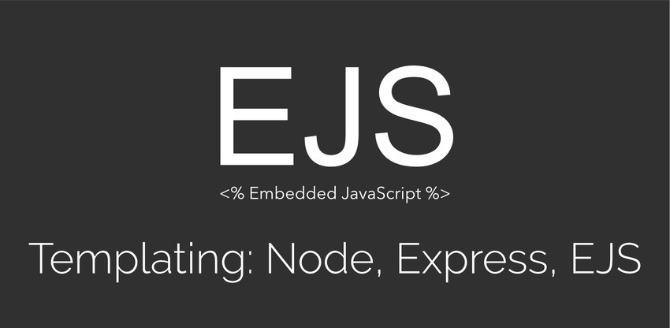

# Read: 12 - Components

*Today Topic will be a about*
- EJS PARTIALS


> What is EJS PARTIALS ? 


*Partials come in handy when you want to reuse the same HTML across multiple views*

*The `<%- %>` tags allow us to output the unescaped content onto the page `(notice the -).` This is important when using the include() statement since you don’t want EJS to escape your HTML characters like ‘<’, ‘>’, etc…*

**Steps**
 
* Fisrt of all,You must create Partials.
* Create a file. This file will contain only the HTML for the navigation bar at the top of the home and post pages
* Now that we have our partials defined, we can use them in our home.ejs and post.ejs templates! In EJS, any JavaScript or non-HTML syntax you include in your templates is always surrounded by <% %> delimiters (you could change these delimiters if you really wanted to).
* Including a partial in EJS is quite straightforward. You use <%- include( PARTIAL_FILE ) %> where the partial file is relative to the template you use it in.
* Note: The <%- %> tags allow us to output the unescaped content onto the page (notice the -). This is important when using the include() statement since you don’t want EJS to escape your HTML characters like ‘<’, ‘>’, etc…

* Creating and including partials is very straightforward with EJS.


**Example**

*create navigation bar and footer  partials*

`For Navigation`

```
<!-- views/partials/navbar.ejs -->
    <div class="header clearfix">
        <nav>
            <ul class="nav nav-pills pull-right">
                <li role="presentation"><a href="/">Home</a></li>
            </ul>
            <h3 class="text-muted">Node.js Blog</h3>
        </nav>
    </div>
```

`For Footer`

```
<!-- views/partials/footer.ejs -->
    <footer class="footer">
        <p>© 90210 Lawyer Stuff.</p>
    </footer>

```

`For HomePage`

```
<!-- views/home.ejs -->
    <!DOCTYPE html>
    <html>
    <head>
        <meta charset="utf-8">
        <title>Node.js Blog</title>
        <link rel="stylesheet" href="https://maxcdn.bootstrapcdn.com/bootstrap/3.3.6/css/bootstrap.min.css">
        <style>
            body {
                padding-top: 20px;
                padding-bottom: 20px;
            }
            .jumbotron {
              margin-top: 10px;
            }
        </style>
    </head>
    <body>
        <div class="container">
            <%- include('partials/navbar') %>
            <div class="jumbotron">
                <h1>All about Node</h1>
                <p class="lead">Check out our articles below!</p>
            </div>
            <div class="row">
                <div class="col-lg-12">
                    <div class="list-group">
                      <!-- loop over blog posts and render them -->
                      LIST_OF_POSTS
                    </div>
                </div>
            </div>
            <%- include('partials/footer') %>
        </div>
    </body>
    </html>
```


**Please Feel Free To Contact Me When You Need help ^_^**
* [www.facebook.com/aghyadalbalkhi](www.facebook.com/aghyadalbalkhi)
* Email : aghyadalbalkhi@gmail.com

